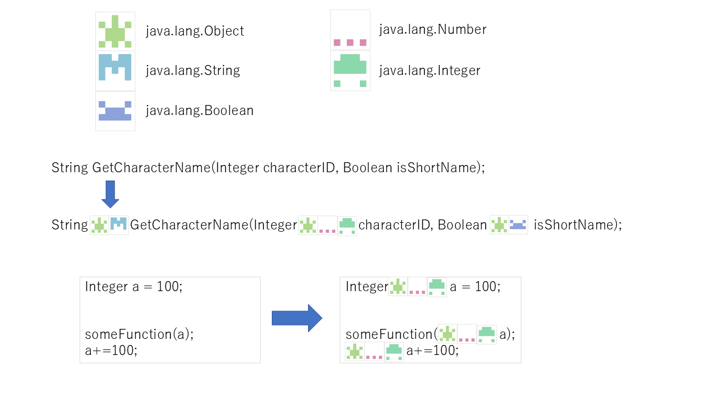

# Typekon

型をidenticonで可視化するVSCode拡張機能です。

Type + Identicon = **Typekon**

## スクリーンショット


## 機能

- 変数の型名からユニークなアイコン（identicon）を生成
- 型名の後ろにアイコンを表示
- 継承関係も視覚化（親クラスのアイコンも表示）
- LSP連携で正確な型情報を取得
- 関数パラメータの型も表示（汎用ホバーベース検出）
- 変数使用箇所にも型アイコンを表示（DocumentHighlights活用）

## 対応言語

| 言語 | 状態 | 必要条件 |
|------|------|----------|
| TypeScript / JavaScript | ✅ | - |
| Java | ✅ | Language Support for Java |
| Go | ✅ | Go extension |
| Python | ✅ | Pylance |
| Rust | ⚠️ | rust-analyzer + Cargo.toml |
| Kotlin | ⚠️ | Kotlin Language extension |
| C# | ⚠️ | C# Dev Kit + .csproj |
| C / C++ | ⚠️ | C/C++ extension + プロジェクト設定 |

⚠️ の言語は、適切な拡張機能とプロジェクト構成が必要です。

## インストール

### 開発版をローカルで実行

```bash
# 依存関係をインストール
npm install

# コンパイル
npm run compile

# VSCodeで開いてF5でデバッグ実行
```

### VSIXパッケージを作成

```bash
npm install -g @vscode/vsce
vsce package
```

## 設定

| 設定 | 説明 | デフォルト |
|------|------|------------|
| `typekon.enabled` | 機能のON/OFF | `true` |
| `typekon.showInheritance` | 継承アイコンを表示 | `true` |
| `typekon.iconSize` | アイコンサイズ (px) | `14` |
| `typekon.showOnDeclaration` | 変数宣言にアイコンを表示 | `true` |
| `typekon.showOnParameters` | 関数パラメータにアイコンを表示 | `true` |
| `typekon.showOnUsage` | 変数使用箇所にアイコンを表示（パフォーマンス注意） | `false` |

## コマンド

- `Typekon: Toggle Type Icons` - 表示のON/OFFを切り替え

## 仕組み

### アイコン生成
1. 型名をハッシュ化（djb2アルゴリズム）
2. ハッシュ値から5x5の対称パターンを生成
3. ハッシュ値からHSLカラーを決定
4. SVGとしてレンダリング
5. VSCodeのTextEditorDecorationとして表示

### 型情報の取得
1. `vscode.executeDocumentSymbolProvider` でシンボル一覧を取得
2. `vscode.executeHoverProvider` で正確な型情報を取得
3. メソッドシグネチャからパラメータを汎用的に検出（ホバーベース）
4. `vscode.executeDocumentHighlights` で変数の使用箇所を追跡

## 今後の改善案

- [x] LSP連携でより正確な型情報を取得
- [ ] ジェネリクスの型パラメータも表示
- [ ] 型エラー時のハイライト
- [ ] カスタム継承関係の設定
- [ ] ホバー時に継承ツリーをポップアップ表示
- [ ] 型定義へのジャンプリンク

## コンセプトアート


## ライセンス

MIT
